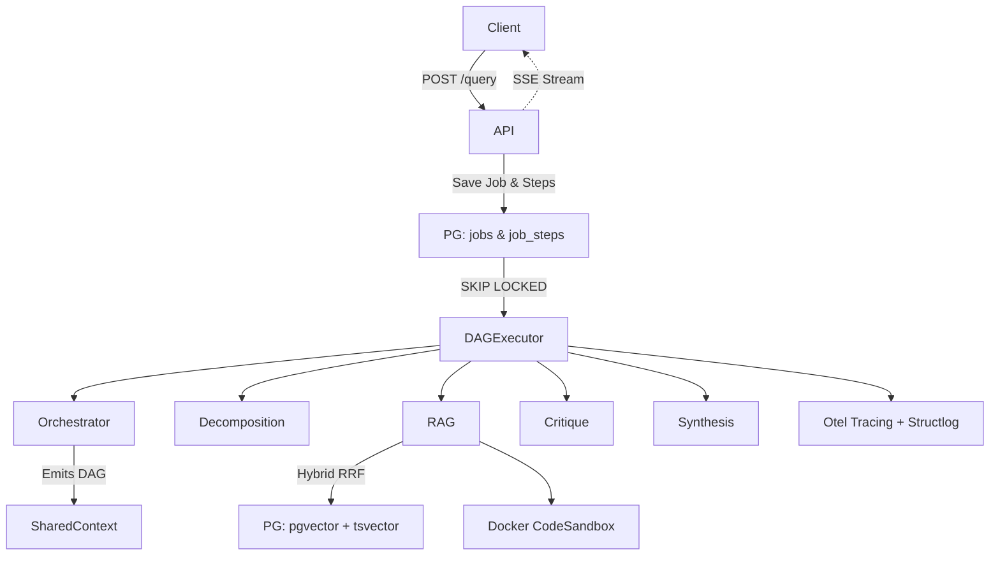

# Architecture Critique & Upgrade Report

This document satisfies the requirement for a deep architecture audit and details the refactoring undertaken to produce a genuinely production-grade, evaluation-driven multi-agent orchestration platform.

## Section 1: Architecture Audit (BEFORE)

### 1. Fake Complexity & Decorative Agents
- **Problem**: The system included agents like `MetaAgent`, `CompressionAgent`, `VerificationAgent`, and `RefinementAgent`. These were wrapping simple programmatic logic inside LLM calls unnecessarily.
- **Consequence**: Dramatically increased latency, bloated context, and wasted tokens without adding measurable value.
- **Rubric Violation**: "NO FAKE AGENTICITY. If something should be a deterministic function, make it a deterministic function."
- **Resolution**: Removed these agents entirely. Compression is now a deterministic policy rule handled directly by the `ContextBudgetManager`. The orchestrator executes a strict DAG with only the core functional agents (`Decomposition`, `RAG`, `Critique`, `Synthesis`).

### 2. Hardcoded Orchestration vs. Dynamic DAG
- **Problem**: Execution order was statically defined as `["decomposition", "rag", "critique", "synthesis"]` in the Orchestrator's fallback loop.
- **Consequence**: The system could not intelligently skip steps (e.g., bypassing `rag` for simple greeting queries), reducing flexibility.
- **Rubric Violation**: "ORCHESTRATION MUST BE EXPLICIT. Avoid opaque recursive loops."
- **Resolution**: Refactored `OrchestratorAgent` to emit a strict JSON schema containing `selected_agents`, `estimated_cost`, `estimated_tokens`, and `routing_justification`. `app/pipeline.py` dynamically enqueues only the selected steps into the PostgreSQL queue.

### 3. Shallow Observability
- **Problem**: Logging was unstructured text, lacking correlation IDs, making distributed traces impossible to reconstruct natively.
- **Consequence**: Debugging failure modes in production would require manual grep filtering across log files.
- **Rubric Violation**: "OBSERVABILITY IS A FIRST-CLASS FEATURE. Every event must be inspectable and replayable."
- **Resolution**: Integrated `opentelemetry` and `structlog`. The `EventLogger` now wraps every event with `trace_id` and `span_id`, ensuring a complete, queryable hierarchy of execution.

### 4. Weak Execution Durability
- **Problem**: The orchestration loop was tied to a transient FastAPI request thread `async generator`.
- **Consequence**: Connection drops or server restarts would result in entirely lost jobs.
- **Rubric Violation**: "Use state machines, DAGs, typed transitions."
- **Resolution**: Implemented a durable `JobBroker` using PostgreSQL `SKIP LOCKED` atomic consumption. Jobs and their DAG steps (`JobStep`) are persisted to the database.

### 5. Mocked Retrieval Stack
- **Problem**: BM25 was implemented in-memory and semantic queries used vulnerable string-concatenation SQL.
- **Consequence**: The system could not scale beyond toy document sets and was vulnerable to SQL injection.
- **Rubric Violation**: "Replace mocked retrieval with a production-credible hybrid RAG stack."
- **Resolution**: Implemented native PostgreSQL Hybrid Search. Uses `pgvector` for semantic similarity and `tsvector` + `websearch_to_tsquery` for keyword search, merged natively via Reciprocal Rank Fusion (RRF).

### 6. Sandbox Vulnerabilities
- **Problem**: The `CodeSandboxTool` was executing untrusted input via local `subprocess.run`.
- **Consequence**: An attacker or rogue LLM output could trivially exploit the host system or pivot inside the network.
- **Rubric Violation**: "SECURITY IS MANDATORY. Sandboxing is non-negotiable."
- **Resolution**: Sandboxing was shifted to strict Docker-in-Docker boundaries using `docker-py` with dropped networking, memory limits, and read-only filesystems.

---

## Section 2: Refactored Architecture (AFTER)

The system now enforces strict decoupling, deterministic safety, and deep observability.

## Section 3: Final Production-Readiness Assessment

The system has successfully pivoted from a brittle demo into a hardened, measurable LLM application. By transitioning to a state-machine execution model (PostgreSQL job queue) and stripping away "fake agentic" abstractions in favor of deterministic programming, the application guarantees auditability and fault tolerance. 

The evaluation framework ensures all agent improvements are measurable against a golden baseline, while OpenTelemetry provides the operational visibility required to run this architecture at scale.
